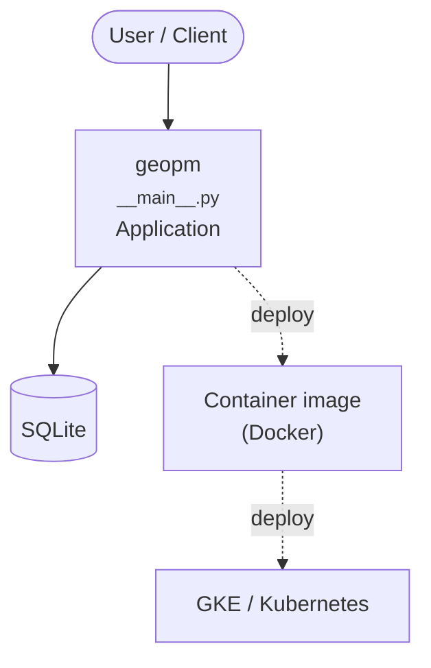

# Context Map — `geopm`

> Auto-generated architecture & deployment context map. Summarizes the core application, container/cloud footprint, and database connections. Regenerate after significant structural changes.

**Repo:** `avnit/geopm` · **Fork** · Public · Primary language: C++ · Default branch: `dev` · Files: 1591

**Description:** Global Extensible Open Power Manager

## 1. Core application

GEOPM - Global Extensible Open Power Manager

- **Entry points:** `geopmdpy/geopmdpy/__main__.py`, `geopmdpy/test/__main__.py`, `geopmpy/geopmpy/agent.py`, `geopmpy/test/__main__.py`
- **Listens on port(s):** 8000

## 2. Containers & cloud applications

**Containers:**
- `integration/k8/geopm-fedora.Dockerfile`
- `integration/k8/geopm-prometheus.Dockerfile`

**Detected cloud platforms / services:** GKE / Kubernetes

## 3. Database connections

**Datastores in use:** SQLite

**Referenced in:**
- `.github/workflows/build.yml`
- `.github/workflows/codeql-analysis.yml`
- `.github/workflows/coverity.yml`
- `.github/workflows/launchpad.yml`

## 4. Architecture diagram

## 5. Security posture

- **Static scan findings:** 15 high, 2 low

| Severity | Rule | File:Line |
|---|---|---|
| high | py-shell-true | `integration/apps/parres/parres.py:124` |
| high | py-shell-true | `integration/apps/parres/parres.py:129` |
| high | py-shell-true | `integration/apps/parres/parres.py:200` |
| high | py-shell-true | `integration/apps/parres/parres.py:205` |
| high | py-shell-true | `integration/apps/parres/parres.py:290` |
| high | py-shell-true | `integration/apps/parres/parres.py:295` |
| high | py-shell-true | `integration/apps/parres/parres.py:378` |
| high | py-shell-true | `integration/apps/parres/parres.py:383` |

---
_Generated by repo context-mapping pass on 2026-08-13._